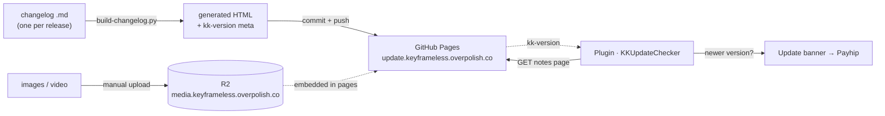
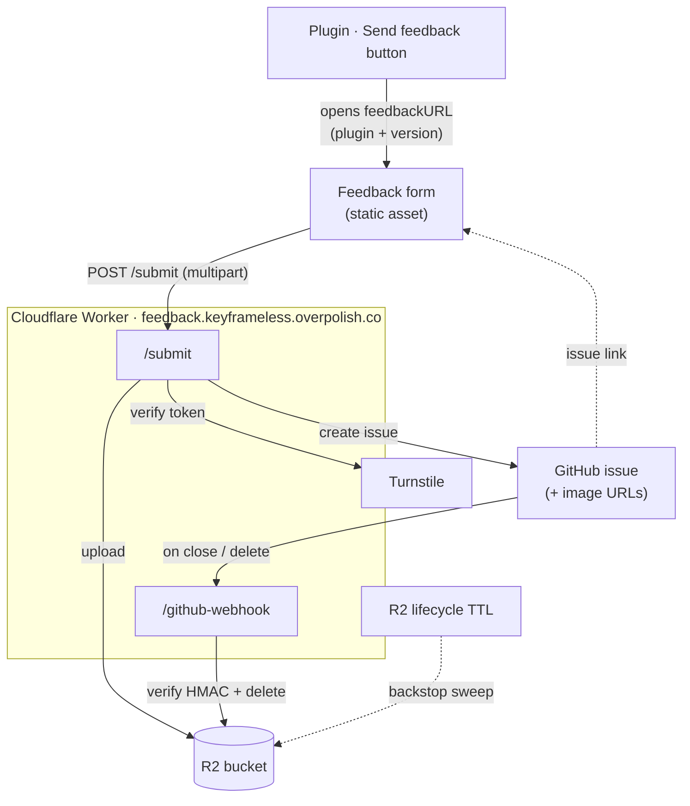

# Contributing

## Set-up

- Install [workflow extension SDK](https://developer.apple.com/download/all/?q=WorkflowExtensions)

...

## Troubleshooting

> [!IMPORTANT]
> macOS registers apps with Launch Services from every location - including Trash, archives, and archive intermediates. If you delete or move a copy of the wrapper app, stale registrations stick around and `pluginkit` can end up parenting the extension to a host app that no longer exists. FCP silently skips it.
>
> Unregister stale paths and re-register the debug build:
>
> Note: the `[ ! -e "$p" ]` guard isn't enough - building the `KeyframelessKit` scheme directly produces its own host app + appex in a separate DerivedData folder that still exists on disk, so two copies share a bundle ID and Launch Services keeps preferring the older one. Unregister by path mismatch instead:
>
> ```sh
> LS=/System/Library/Frameworks/CoreServices.framework/Frameworks/LaunchServices.framework/Support/lsregister
> KEEP="$(pwd)/DerivedData/Keyframeless/Build/Products/Debug/Keyframeless X.app"
>
> # unregister every copy except the debug build
> $LS -dump | grep -B20 'identifier:.*co.overpolish.keyframeless.Keyframeless-X$' \
>   | grep "path:" | sed 's/.*path: *//; s/ (0x.*//' \
>   | while read -r p; do
>       [ "$p" != "$KEEP" ] && $LS -u "$p" && echo "Unregistered: $p"
>     done
>
> # re-register the debug build
> $LS -f -R -trusted "$KEEP"
> pluginkit -a "$KEEP/Contents/PlugIns/Keyframeless X FCP.appex"
> pluginkit -e use -i co.overpolish.keyframeless.Keyframeless-X.Keyframeless-X-FCP
> ```
>
> Restart FCP after fixing.

## OSC not showing in the viewer (and guides reporting "disabled")

If a plugin's on-screen control (OSC) never draws over the FCP viewer - and the Help window's interactive guides keep showing "Guides are disabled, select a clip..." even with the clip selected and the mouse over the viewer - check the **Motion template** for the effect before chasing it in plugin code.

Open the effect's `.moef`/`.motn` template in Motion and confirm the **Publish OSC** checkbox is enabled on the relevant parameter group. Without it, FCP registers the OSC class from the plugin's Info.plist but never instantiates it - so `drawOSC` never fires, the `KKOSCGuideBridge` never receives a draw tick, and `RoundedHasCanvasReference()` (and its peers) stays false forever. The plugin's render path is unaffected, which is why parameter adjustments still work normally.

Quick sanity check that points at this cause: add `+ (void)load` and an `initWithAPIManager:` log to the OSC class. If `+load` fires but `initWithAPIManager:` never does (with the clip selected, mouse over the viewer, View > Show On-Screen Controls on), it's the template missing Publish OSC.

## Resetting the joyride intro (debug builds)

Debug XPC service builds are non-sandboxed, so `NSUserDefaults` writes to `~/Library/Preferences/<BundleID>.plist` instead of the sandbox container. The `defaults` CLI looks in the container and won't find or delete the key. To reset the intro-seen state:

```sh
plutil -remove introSeen ~/Library/Preferences/Rounded-XPC-Service.plist
killall cfprefsd
```

`cfprefsd` restarts automatically and re-reads from disk. The joyride will auto-show on the next fresh (no-lanes) clip.

> Production sandboxed builds use the container path - `defaults delete <BundleID> introSeen` works normally there.

## Switching languages during development

Plugin UI (Rounded, the timeline sequencer) and the workflow extension are localized via String Catalogs (`.xcstrings`). To see another language while developing:

> [!IMPORTANT]
> Use the **global** `AppleLanguages` for everything, and make sure FCP has **no per-app override**. Why: the FxPlug plugin (Rounded render XPC + ViewBridge inspector/joyride are separate system-spawned processes) reads the global language directly. The workflow extension instead follows **FCP's own** language - which falls back to the global only when FCP has no per-app override. A stale `com.apple.FinalCut` override therefore pins the extension to that language while the plugin tracks the global, so they disagree.
>
> One-time: clear any FCP per-app override so FCP (and the extension) follow the global:
>
> ```sh
> defaults delete com.apple.FinalCut AppleLanguages   # then reboot FCP
> ```
>
> Do NOT `defaults write com.apple.FinalCut AppleLanguages` - keep FCP on the global.

Then set the language **globally** and reboot FCP. The repo ships all 7 Final Cut languages; pick one:

```sh
defaults write -g AppleLanguages '("de-DE","en-GB")'    # German
defaults write -g AppleLanguages '("fr-FR","en-GB")'    # French
defaults write -g AppleLanguages '("es-ES","en-GB")'    # Spanish
defaults write -g AppleLanguages '("zh-Hans","en-GB")'  # Chinese (Simplified)
defaults write -g AppleLanguages '("ja-JP","en-GB")'    # Japanese
defaults write -g AppleLanguages '("ko-KR","en-GB")'    # Korean
# then reboot FCP
```

Revert to English:

```sh
defaults write -g AppleLanguages '("en-GB")'   # then reboot FCP
```

(Use `write`, not `delete` - `defaults delete -g AppleLanguages` reports "Domain not found" and leaves the value in place, so explicitly writing your language is the reliable reset.)

String Catalogs are compiled at build time (`xcstringstool` emits `<lang>.lproj/<Table>.strings` into the bundle), so **editing a translation requires a rebuild** before it shows up - it is not a runtime swap.

## How updates and feedback fit together

Two related-but-separate systems share the docs site and the in-plugin banner.

**Update checking** - changelog generated from Markdown and served by GitHub Pages (media hosted separately in R2), polled by each plugin on launch:



**Feedback** - the same banner's "Send feedback" button opens a Cloudflare Worker that turns a form into a GitHub issue, with screenshots stored in R2:



## Previewing the changelog site (and the update banner)

The changelog/update site under `docs/` is generated from Markdown - one file per
release at `docs/changelog/<component>/<version>.md`. Edit a `.md` (or
`docs/assets/style.css`), then rebuild and serve:

```sh
python3 scripts/build-changelog.py
cd docs && python3 -m http.server 8000
```

Open http://localhost:8000/ for the suite index, or http://localhost:8000/rounded/
for a plugin page. The generated `index.html` files are build output - edit the `.md`
and rerun the script, never the HTML.

Debug builds point `KKUpdateChecker` at `http://localhost:8000` (release builds use the
live domain), so a running debug plugin reads the local page's `<meta name="kk-version">`
tag. To make the update banner actually fire, serve a version newer than the installed
one:

```sh
# bump the served version above what's installed, then rebuild + reload the plugin
cp docs/changelog/rounded/3.0.0.md docs/changelog/rounded/9.9.9.md
python3 scripts/build-changelog.py
```

Delete the throwaway `9.9.9.md` (and rebuild) before committing - a stray release file
would publish a bogus version and trip the checker for real users.

> [!IMPORTANT]
> FCP-hosted plugins don't inherit Xcode scheme env vars, so the banner can't be forced
> with an environment variable. For pure UI work without a server, flip the compile-time
> switch instead: `forceUpdateBanner` in `AppShell.swift` (Keyframeless X) or
> `kKKForceUpdateBanner` in `KKLogoBannerView.m` (Rounded). Keep both `false`/`NO` for
> shipping.

## Running the feedback form locally

The "Send feedback" button (in every plugin's banner and the Keyframeless X top bar) opens a form backed by a Cloudflare Worker in `feedback-worker/`. The Worker serves the form and turns submissions into GitHub issues.

```sh
cd feedback-worker
npm install
cp .dev.vars.example .dev.vars   # then fill in the two values below
npm run dev                      # serves form + /submit at http://localhost:8787
```

`.dev.vars` (gitignored) needs:

- `TURNSTILE_SECRET` - Cloudflare's always-pass test secret `1x0000000000000000000000000000000AA` is fine for local dev (it passes any token); use the widget's real secret for a true end-to-end check.
- `GITHUB_TOKEN` - a fine-grained PAT with Issues: Read and write on this repo. Submitting locally creates a **real** GitHub issue, so use a throwaway and delete it.

Debug plugin builds point `KKUpdateChecker` at `http://localhost:8787/`, so a running debug plugin's feedback button opens the local form. Open it directly with prefilled context at http://localhost:8787/?plugin=rounded&version=1.2.3.

The form's CSS/icons are copied from `docs/assets` by `npm run sync-assets` (run automatically by `dev`/`deploy`) - edit the originals in `docs/assets`, never the copies under `feedback-worker/public/assets`.

Screenshot uploads go to R2. Under local `wrangler dev` they land in a local R2 simulation, so the embedded image URLs (which point at the public `r2.dev` base) won't resolve - use `wrangler dev --remote` to exercise real uploads, or just verify image handling in production.

## VSCode

If you're using VSCode with clangd, run the following after building the project to generate the language server config:

```sh
# List available schemes
xcodebuild -workspace Keyframeless.xcworkspace -list
```

```sh
# Build `Keyframeless X FCP` scheme
xcode-build-server config -workspace Keyframeless.xcworkspace -scheme "Keyframeless X FCP"
```

Re-run with a different scheme if you're editing files in that target. Then restart the language server.

### "Module map file not found" error

If clangd reports `Module map file '…/DerivedData/…/module.modulemap' not found`, the `.clangd` config has drifted to reference DerivedData-generated paths that don't exist yet. The fix is to keep a static `module.modulemap` in the source tree and point `.clangd` at that instead.

`KeyframelessKit/KeyframelessKit/module.modulemap` already exists for this purpose. If `.clangd` ever regresses to a DerivedData path, update the `-fmodule-map-file` flag back to:

```
-fmodule-map-file=/path/to/repo/KeyframelessKit/KeyframelessKit/module.modulemap
```
