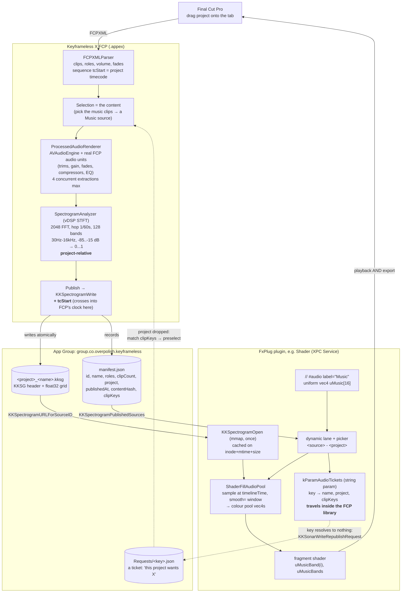

# Keyframeless X

The workflow extension. Two tabs over one shared project drop: **Steno** (transcription and captions) and **Sonar** (audio analysis, free). Both read the same FCPXML, so a project loaded in one appears in the other.

Sonar turns a project's audio into a timeline-indexed spectrogram and publishes it where visual plugins can read it. Shader is consumer #1 (`// #audio`), but nothing about the published data is Shader-specific.

## Why Sonar exists

Final Cut Pro never hands a plugin the audio and the timeline together. An AUv3 effect gets audio but no transport (FCP passes neither musical context nor position, so an AU cannot locate itself on the timeline), and on export FCP renders video with **no audio interleaved at all**. A plugin cannot listen to the timeline as it renders, so the obvious design (an AU that taps the mix and shares it live) fails at the only moment that covunts: the bake.

Sonar sidesteps it by moving the analysis **offline and ahead of time**, reconstructing the audio from the project itself. The plugin then does a table lookup at its own render time, which behaves identically during playback, scrubbing, and export.

## The flow



The dotted path is the republish handshake, and it only exists because **nothing but plugin parameters travels inside an FCP library**. Carry a project to another Mac and the app group is empty: every binding dangles and nothing on disk can say what was lost. So the plugin carries a **ticket** (what it is bound to, and the clips that made it), notices its key resolves to nothing, and leaves a request. Sonar reads that on the next drop and preselects those clips, so Publish reproduces the same hash, the same key, and the binding reconnects with nothing re-pointed.

It is one-way and nothing waits: the plugin drops a note and carries on rendering silence, and the note may never be read.

The app group is the whole point of the middle. A workflow extension's `temporaryDirectory` is private to its sandbox, so a plugin in a different sandbox can never see it. Both sides already carry `group.co.overpolish.keyframeless` (the AI helper socket uses it too), which makes that container the one place the writer and the reader can both reach.

Analysis is fast enough to have no Analyse button: the spectrogram follows the selection. Publish is the only explicit action.

## The file is the contract

`KKSpectrogram` (in KeyframelessKit) defines the `.kksg` layout once and owns **both** the writer and the reader, so the extension and every plugin agree by construction. A Swift copy of the layout would drift the moment either side changed.

```
char[4]  "KKSG"      uint32 version   uint32 numFrames   uint32 numBands
float64  hopSeconds  float64 timelineStart
float64  floorDB     float64 ceilingDB              <- v2+ only
float32  data[numFrames * numBands]    row-major [frame][band], 0...1
```

Everything is **little-endian**. `CFConvertDoubleHostToSwapped` produces big-endian and is the wrong tool here.

The dB window is in the file because it is the analysis window, and Sonar's config invites you to tune it. `data` is already normalised into `floor...ceiling`, so a consumer that wants real dB back (a noise gate, say) can only get there if the file says what the window was. Hard-code the old -85/-15 in a consumer and every gate silently re-scales the day that config changes. v1 files have no such fields and legacy constants stand in, which is why the data offset branches on version.

`KKSpectrogramSampleAtTime` is render-path safe by design: no allocation, no locking, no Objective-C messaging, just interpolated reads straight off the mapping. Times outside the published range fill zeroes and return `NO`, so a consumer can tell silence from "nothing published here". Nothing bound, a deleted source, and an out-of-range moment all render silence rather than failing.

Sampling used to read the manifest per frame. It is now cached on the manifest's `inode + mtime + size`, in the kit rather than in any one consumer, so the filename stays where the format lives and the next consumer inherits the fix.

## Temp files clean themselves up

Reconstructing a clip's processed audio writes an uncompressed Float32 WAV at the source rate: **~1.4GB per hour** of 48kHz stereo, one per clip, and every edit to a clip mints a fresh fingerprint and a fresh file. Nothing runs at process exit to remove them, and the system does not sweep a sandboxed container's tmp while the container is in use. Left alone this reached **19GB**.

Two mechanisms, because they solve different halves:

- **`TempJanitor.sweepOnce()`**, called at launch before anything can write, removes what a _previous_ run stranded: renders, Steno's extraction and segment temps, and `CFNetworkDownload_*` partials from cancelled model downloads (CFNetwork's own staging, which lands in our container and which nobody else collects - one abandoned download left 5GB). It works by age against a cutoff captured at launch, so nothing live can be caught, whatever way the last run died. That matters precisely because the case being cleaned up after is the one where bookkeeping didn't run.
- **`ProcessedAudioRenderer`'s byte-budgeted LRU** bounds growth _within_ a run.

The renderer hands out audio through `withRenderedAudio(for:)`, not a bare URL, and that shape is deliberate: it leases the file for the duration of the call so eviction cannot delete it mid-read. Read what you need inside the closure and don't hold the URL.

## The clock (read this before touching timing)

**An FxPlug render time in FCP is native media time, not timeline time.** `renderTime`, `startTimeForEffect:`, and `startTimeOfInputToFilter:` all speak the input's own clock (where the clip sits in its _source_). `inPointTimeOfTimelineForEffect:` returns the project's own `0..duration` range, not the origin, despite the name.

`timelineTime:fromInputTime:` is the only API that speaks timeline, and it includes the project's start timecode. That is what Shader samples at, and what makes a clip cut out of the middle of a project line up instead of rendering static.

The other half of the mapping is FCPXML's `<sequence tcStart="...">`, which **is** the project's start timecode and is reliable (`7200s` matches FCP's `02:00:00:00`). So:

```
timelineTime:fromInputTime:renderTime   ↔   tcStart + projectRelativeSeconds
```

No constant, no host branch. A fixed `3600` offset fit one project by coincidence and broke on the next one.

Note where `tcStart` is added: at **publish**, not in the model. The analyzer stays project-relative because it also feeds Sonar's own preview, and keying that to 7200 would draw the picture two hours off the right of the canvas.

> [!NOTE]
> The header comments in `KKSpectrogram.h` and `ShaderAudioPool.h` still claim generator `renderTime` **is** timeline seconds. That was the assumption before it was measured, and the render path no longer relies on it. Worth correcting.

## Source identity

Identity is the **clips, not the name**. `contentHash` fingerprints the exact selection with its edits, so:

- Publishing three music cues, then three different ones, gives two sources ("Music" and "Music 2"). Two shaders can drive off different music.
- Re-publishing the _same_ clips refreshes that source in place instead of piling up copies.
- A volume tweak or an added effect counts as new content, because the fingerprint covers the edit.

The name is only a label, derived from roles (pick the music clips and it's "Music") and renameable inline. No naming dialog, because publishing should stay one click.

**The fingerprint is portable, and that is load-bearing.** `AudioClipFingerprint` comes in two flavours: `of` keys local caches by absolute URL (two same-named files in different folders must not collide), while `identity` keys published sources by _filename_ (two copies of one project on two Macs must not differ). `contentHash` uses `identity`.

It has to. A shader stores `ShaderAudioSourceKey(contentHash)` in its lane, and that lane travels with the project inside the FCP library. Nothing else does - not the `.kksg`, not the manifest. So a project carried to another Mac finds an empty container, and the _only_ way its shaders can reconnect is for a fresh publish of the same clips to reproduce the same hash. Key `contentHash` on absolute paths and it can't: the media resolves elsewhere, every hash shifts, and republishing mints a source the shader has never heard of. Republish on any Mac, and the binding comes back on its own.

`SonarSource.identityVersion` records which scheme a hash was built with. Bumping it invalidates every stored binding by definition, so older entries are purged (grid and all) on the first read that sees one, rather than lingering in the list matching nothing and colliding with their own republish as "Music 2".

The publish writes atomically, which swaps in a new inode. That is exactly what the plugin's `inode + mtime + size` cache key notices, so a re-publish is picked up while the old mapping stays valid for anything mid-render.

## Adding a consumer

Nothing in the format is Shader-specific. A plugin needs the app group entitlement on its **XPC Service** target, then:

1. `KKSonarSourceKeyForSource()` for the value your picker stores, and `KKSpectrogramPublishedSources()` to populate it (the manifest exists so you never open a float grid to build a menu). Name entries `<source> - <project>`: a source only lines up with the project it came from. **Never store the menu index** - the published set changes between sessions, so an index means something different the moment a source is deleted.
2. `KKSpectrogramURLForSourceID` + `KKSpectrogramOpen` once, cached, never on the render path.
3. `KKSpectrogramSampleAtTime` at `timelineTime:fromInputTime:`.
4. `KKSonarSourceForKey()` returning nil to tell `None` (key 0) from **missing** (a key that resolves to nothing). Both render silence and only one is a problem, so a picker that can't distinguish them tells the user nothing.
5. `KKSonarTicketForSource()` on bind, stored in one of your own params, and `KKSonarWriteRepublishRequest()` when a key stops resolving. That is what makes a binding survive the trip to another Mac.

The kit owns every part of that except **where the ticket's bytes live**, which is the one question a consumer answers for itself. Shader keeps its map in `kParamAudioTickets`, a hidden _string_ param - deliberately not a blob, since a ticket describes what Sonar published rather than a decision the user made, and has no business on the undo stack (`KKDataBlob.h` explains that blobs exist precisely _because_ string writes aren't undoable; here that is the feature). Keyed by source key, not by uniform, so an entry an undo strands is inert rather than wrong. See `Plugin+AudioTickets.m`.

Shader adds one layer on top: `ShaderParseAudioProps` reads `// #audio`, the transpiler emits `<name>Band(i)` and `<name>Bands` accessors (four bands pack per `vec4`, because std140 pads a float array to a 16-byte stride), and `ShaderFillAudioPool` fills the colour pool. Limits are `KK_SHADER_MAX_AUDIO_PROPS` (2) and `KK_SHADER_MAX_AUDIO_VECS` (24).

Smoothing (`smooth=`, default 0.08s) is a window **centred** on now, applied here rather than in the shader. A fragment shader has no memory of previous frames, and FCP renders out of order (scrubbing, motion blur, pre-render), so a shader-side running filter would make a frame depend on how you reached it.

## AI docs

The user-facing explanation lives in `KeyframelessKit/Resources/AudioKnowledge/`, as `audio-sonar.md` (the tab, publishing, what selection means) and `audio-shader-directive.md` (`#audio`, the accessors, shaping tips). It sits in the **kit** because neither plugin owns it: Sonar publishes, Shader consumes.

Both sides register both topics via `onlyTopicIDs`, so Shader's AI can tell a user that Sonar exists and that they must publish first, and Sonar's can explain what the data is for.

## Logs

Subsystem `co.overpolish.keyframeless`. Use `os_log`, never `print`: **`print` does not reach Console from an FCP-hosted extension**, and plugin-side code follows the usual `KKLog*` rule.

```sh
log show --last 5m --predicate 'subsystem == "co.overpolish.keyframeless"' --info
```

A shader rendering static is almost always the clock, not the data. Check the sampled timeline time against `tcStart + clip start` before suspecting the spectrogram.
