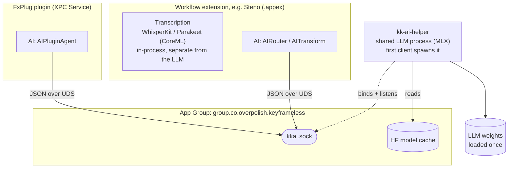

# KeyframelessAI

Shared AI layer for the suite. Cloud providers (Claude and ChatGPT, BYOK) work the moment you link the package. Local (on-device, Apple MLX) needs per-target wiring, below.

Plugins call `AIPluginAgent` (natural language to timeline mutations, plus streaming Q&A); Steno calls `AIRouter` / `AITransform` (caption edits, plus a streaming Q&A route). Both reach local inference through one shared helper.

## Local inference

On-device inference runs in a single out-of-process helper (`kk-ai-helper`), not in the calling process: the FCP workflow extension is killed at its ~1 GB watermark if it loads MLX in-process, and per-instance loads would each cost ~16 GB. One helper, one model load, serves every plugin and extension.



It binds a Unix socket in the app-group container (`group.co.overpolish.keyframeless/kkai.sock`). The first client spawns it from its own bundle; the rest connect. The open connection is the ref-count, so when the last client disconnects the helper idle-exits after 30 min (an open client keeps it alive). The HF model cache lives in the same app-group container, so whoever spawns the helper finds the downloaded model. Streaming and status ("Loading model", "Thinking") flow back over the socket automatically.

`LocalLLM.defaultRunner()` picks the engine, no code changes needed:

- app-group reachable: `SharedHelperRunner` (the shared helper), plugins and the extension alike
- no app group, `.appex`: `nil` (local disabled, never an in-process crash)
- no app group, plugin: `MLXLocalLLMRunner` (in-process)

## Wiring a new client

Per client target. Each separate Xcode project needs its own helper target (a project can't embed another's product).

1. Link the `KeyframelessAI` library.
2. Add a Command Line Tool target `kk-ai-helper`.
   - Replace Xcode's `Hello, World!` `main.swift` with `import KeyframelessAI` then `LocalAIHelperServer.run()`,
   - Link the library.
   - No entitlements (it gets the socket path via `--socket`).
3. Embed it
   - Copy Files - destination Executables with Code Sign On Copy in the process that runs inference:
     - the XPC Service target for an FxPlug plugin,
     - the `.appex` for an extension. It must land in that bundle's `Contents/MacOS/`.
4. Add the App Group `group.co.overpolish.keyframeless` and turn on Automatic signing.

> [!IMPORTANT]
> Add the App Group via Signing & Capabilities, not by editing `.entitlements` (the profile won't get the capability and the build fails with "requires a provisioning profile with the App Groups feature"). Put it on the app-level target: the containing app for an extension, the Wrapper Application for a plugin (an XPC Service target can't take App Groups in the UI). The child reaches the container through it. Automatic signing must be on across the whole embed chain or the embedded helper fails the parent-certificate check.

## Models

Model state is in-process; the helper is inference-only. Drive `LocalModelStore.shared` (`download`, `select`, `uninstall`, `selectedModelID`, `hasReadyModel`) or present `LocalModelsView`; the catalog is `LocalModelCatalog.models`.

Local is gated to Apple Silicon with 24 GB+ RAM (`AIPlatform.supportsLocal`); below that, `.local` is hidden and clients use the cloud providers.

## Logs

Subsystem `co.overpolish.keyframeless`, categories `ai.helper` (routing, spawn, socket) and `ai.local` (load and generation timings):

```sh
log show --last 5m --predicate 'subsystem == "co.overpolish.keyframeless"' --info
```

`spawn FAILED` or "did not come up" means the helper isn't embedded in this client's bundle, or it's still the Hello-World stub. `extension has no app-group socket` means the App Group isn't registered on the app-level target.
