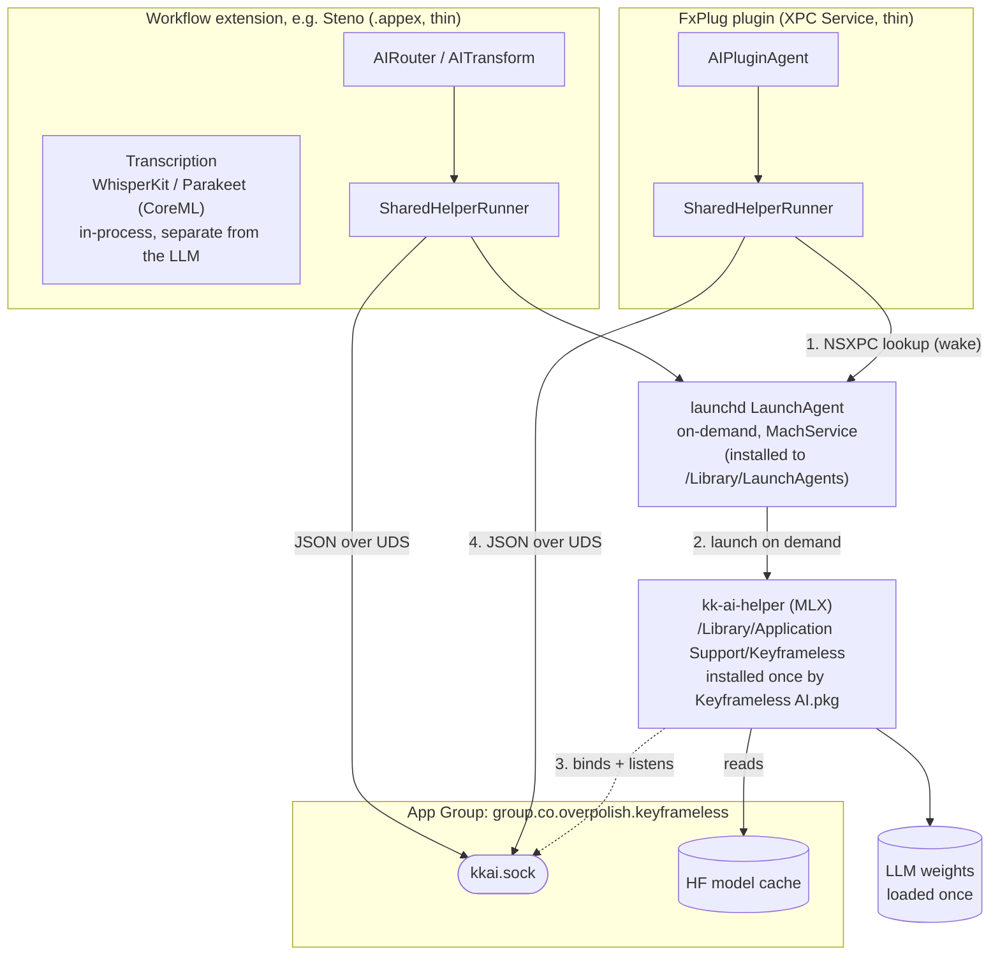

# KeyframelessAI

Shared AI layer for the suite. Cloud providers (Claude and ChatGPT, BYOK) work the moment a target links the thin package. Local (on-device, Apple MLX) runs in a shared engine installed separately, so the plugins ship none of it.

Plugins call `AIPluginAgent` (natural language to timeline mutations, plus streaming Q&A); Steno calls `AIRouter` / `AITransform` (caption edits, plus a streaming Q&A route). Both reach local inference through the same shared helper.

## Package layout

Two library products, so the MLX inference engine never links into a plugin - it ships once, in the shared helper:

- **`KeyframelessAI`** (thin, no MLX, no swift-huggingface): providers, UI, keychain, plugin-agent, IPC wire types, the `LocalLLMRunner` protocol + `SharedHelperRunner`, and model-state tracking (`LocalModelStore` - it drives download over the socket, but the HF client itself lives in the helper). **Every plugin and extension links this.**
- **`KeyframelessAILocal`** (heavy, MLX + swift-huggingface): `MLXLocalLLMRunner` + `LocalAIHelperServer` (inference **and** model download). Linked **only** by the helper. Depends on the thin product (one-way).
- **`kk-ai-helper`** (`executableTarget`): `import KeyframelessAILocal; LocalAIHelperServer.run()`. Built once, shipped by the separate "Keyframeless AI" installer.

## Local inference

On-device inference runs in a single out-of-process helper (`kk-ai-helper`), shared by every plugin and extension. It is installed **once** by the "Keyframeless AI" package to `/Library/Application Support/Keyframeless/kk-ai-helper` and launched **on demand by launchd**. Plugins never embed it.

A sandboxed FCP plugin can't exec an out-of-bundle binary, but it can look up an app-group Mach service. The installer registers an on-demand LaunchAgent vending `group.co.overpolish.keyframeless.aihelper`; `SharedHelperRunner` opens an `NSXPCConnection` to it, launchd starts the helper, and the helper binds its unix socket in the app-group container. From there the data path is the proven one: length-prefixed JSON over the socket, with streaming, status, and cancel. The same control channel carries model **download** (the helper runs the HuggingFace fetch and streams progress), **cancel-download** (cancels the fetch and drops the partial to free disk), and a **status** reply that reports any in-flight download's model + fraction so a plugin that didn't start it mirrors the progress live.



The open socket connection is the ref-count: when the last client disconnects the helper idle-exits after 30 min (an open client keeps it alive), and launchd relaunches it on the next lookup. The HF model cache lives in the same app-group container, so a model downloaded by any client serves them all.

`LocalLLM.defaultRunner()` picks the engine, no code changes needed:

- app-group reachable: `SharedHelperRunner` (the shared helper), plugins and the extension alike
- no app group: `nil` (local disabled, never an in-process MLX link). The UI shows an "Install Keyframeless AI" note and the Action tab disables local (see `KKAIEngine`).

## Adding a new plugin

From the repo root, run `scripts/convert-plugin-to-thin.py <Plugin>`. It removes any embedded `kk-ai-helper` target + Copy Files phase and adds the app group `group.co.overpolish.keyframeless` to the plugin's **XPC Service** target. Then:

1. The XPC Service already links the `KeyframelessAI` (thin) product by name, so nothing else to wire for the client.
2. Local AI needs the shared engine installed. Build it with `scripts/build-and-sign.sh keyframelessai <apple-id> <team-id>` and ship `Keyframeless AI.pkg` (it is a package in the combined `Distribution/Keyframeless.pkgproj`; `split-pkgproj.py` extracts the standalone). Users install it once.

No per-plugin helper target, no Copy Files embed, no in-process MLX. `KKAIEngine.isInstalled` (checks `/Library/Application Support/Keyframeless/kk-ai-helper`) gates the install note + Action tab.

> [!NOTE]
> The XPC Service target now carries the App Group entitlement directly (via its own `<Plugin>PluginEntitlements.entitlements`), not the Wrapper Application. With automatic signing, adding it in Signing & Capabilities is equivalent; the conversion script writes the entitlements file for you.

## Dev loop (without the installer)

Because `SharedHelperRunner` connects to the socket before trying to wake the helper, you can run the helper yourself and the plugin picks it up:

- `scripts/run-dev-helper.sh` builds + runs the helper manually (borrows a metallib from a recent Xcode build, or builds one via xcodebuild). No launchd, no signing.
- `scripts/install-dev-launchagent.sh` signs a release build and installs a dev LaunchAgent, so the real launchd Mach-service wake is exercised with your local binary.

## Models

Drive `LocalModelStore.shared` (`download`, `cancelDownload`, `select`, `uninstall`, `selectedModelID`, `hasReadyModel`) or present `LocalModelsView`; the catalog is `LocalModelCatalog.models`. The **helper** runs the actual swift-huggingface fetch into the shared app-group cache (`…/group.co.overpolish.keyframeless/huggingface/hub/`); the store just drives it over the socket and forwards progress. "Downloaded" means the helper wrote a `.kkcomplete` marker in the repo dir on full success (`isDownloaded` checks for it - a partial or cancelled fetch leaves blobs but no marker, so it correctly reads as not-downloaded). While `LocalModelsView` is on screen, `startHelperSync`/`stopHelperSync` poll the helper so a download started in another plugin shows live progress here too.

Local is gated to Apple Silicon with 24 GB+ RAM (`AIPlatform.supportsLocal`); below that, `.local` is hidden and clients use the cloud providers. Note the helper is arm64-only (MLX is Apple-Silicon).

## Logs

Subsystem `co.overpolish.keyframeless`, categories `ai.helper` (routing, wake, socket) and `ai.local` (load and generation timings):

```sh
log show --last 5m --predicate 'subsystem == "co.overpolish.keyframeless"' --info
```

"did not come up" / connect failures usually mean the **Keyframeless AI engine isn't installed** (no `/Library/Application Support/Keyframeless/kk-ai-helper`, so the LaunchAgent Mach service isn't registered) or the plugin is missing the app-group entitlement. `no app-group socket; local disabled` means the app group isn't on this target.
