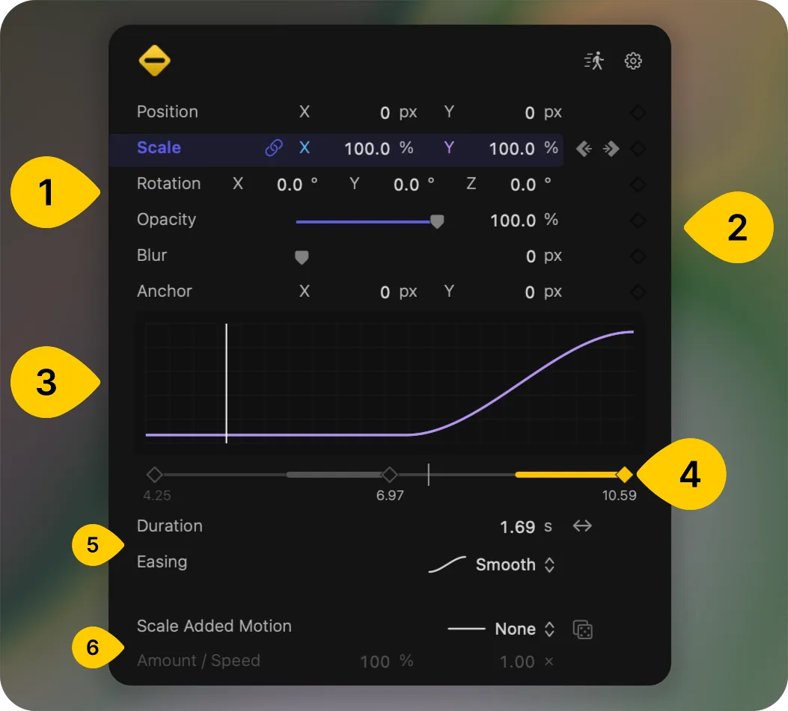

# Magic Move: a five minute guide

Magic Move animates a clip the usual way, with keyframes you place, but each keyframe owns the timing of the move that arrives at it. Rather than one speed for the whole animation, every keyframe decides how long its move takes and how it eases in and out. This beta exists to find out whether that reads well in practice, so the plugins you already have are untouched and keep working alongside it.

## Getting it on screen

Run the Keyframeless installer, then restart Final Cut Pro or Motion. In Final Cut Pro the effect is under Effects, in the Keyframeless category; in Motion it is under Filters, Keyframeless. Drop it on a clip and its controls appear in the inspector.

To remove it later, open `/Applications/Keyframeless/MagicMove.app` and press Uninstall. It takes a couple of seconds and asks for nothing.

## 1. The properties

Position, Scale, Rotation, Opacity, Blur and Anchor. Click a number to type into it, or drag across it to scrub. The link next to Scale keeps X and Y in proportion. Anchor is the pivot that scale and rotation turn around; moving it on its own does not move the image, it just changes what the other properties pivot from.

Click a row to select it. The graph and all the timing controls below follow whichever property is selected.

Right-click a property's label for its menu: **Link with** pairs its keyframes with another property so they move together, **Match In/Out** makes the first and last keyframes mirror each other, and **Reset Parameter** puts the property back to its default and clears its keyframes.

## 2. The keyframe buttons

This is Final Cut Pro's own keyframe control, one per property. The diamond adds a keyframe at the playhead, or removes the one already there. The arrows jump to the previous and next keyframe. Magic Move stores its values in ordinary native keyframes, so the keyframe editor and everything else you already know about keyframes in the host applies here too.

By default, changing a value where there is no keyframe creates one. If you would rather place keyframes deliberately, turn on **Explicit Keyframe Editing** in the settings cog at the top right.

## 3. The curve

The shape of the selected property across the whole effect, with the white line marking the playhead. Click or drag inside the graph to move the playhead. If the property is linked to others, they are drawn alongside it, with matching colours per axis.

## 4. The keyframe rail

Every keyframe on the selected property, with its time in seconds underneath. The highlighted section is the transition you are editing: the one arriving at the next keyframe ahead of the playhead, or, when you are standing exactly on a keyframe, the move into that keyframe. Everything in sections 5 and 6 applies to that highlighted section, which is the part worth getting used to first.

## 5. Duration and Easing

**Duration** is how long the move into that keyframe takes. The value before it is held until the move needs to begin, so a short duration on a long gap means the clip sits still and then moves late and quickly. A duration of zero cuts straight to the new value on arrival.

The arrows button beside the duration is **use all available time**: turn it on and the move fills the whole gap between the two keyframes. Turn it off and the fixed duration you set comes back.

**Easing** shapes that move: Smooth, Linear, Ease In or Ease Out. The graph updates as you change it.

Right-click either control and choose **Set Default** to make the current setting the one new keyframes start with.

## 6. Added Motion

Layered movement on top of the transition, for when a move should feel less mechanical. Choose Wave, Wiggle or Handheld, then set **Amount** for how far it strays and **Speed** for how quickly. The dice gives the same settings a different random shape, so press it until the movement feels right.

Added Motion belongs to the keyframe at the start of the section, because it fills the gap that follows. Right-click its label to choose which components move, and to make the axes drift independently of one another.

## The header

The cog holds the settings, including Explicit Keyframe Editing. The figure beside it toggles motion blur for the effect; right-click it for sample count and shutter angle, or press Control-Option-M while the inspector is open. Motion blur applies to Added Motion as well as to transitions.

## Worth trying in five minutes

1. Apply Magic Move to a clip and put the playhead at the start.
2. Drag Position X to move the clip off to one side.
3. Move the playhead two seconds later and set Position X back to zero. That creates the second keyframe and the move between them.
4. Select the Position row and look at the rail: the highlighted section is the move you just made.
5. Set Duration to half a second. The clip now holds its position and makes the move late and fast.
6. Turn on use all available time. The same move now spreads across the whole two seconds.
7. Switch Easing between Ease Out and Smooth and watch the curve change shape.
8. Set Added Motion to Wiggle with an Amount around fifty percent, and press the dice a few times.

That is the whole model: place keyframes as usual, then decide per keyframe how the arrival at it should feel.

## What is most useful to hear back

Whether the per keyframe timing reads naturally once you have built a real move, whether the hold before a short duration is what you expected or a surprise, how Match In/Out behaves on the kind of entrances and exits you actually build, and anything that felt slow or awkward inside Final Cut Pro.
