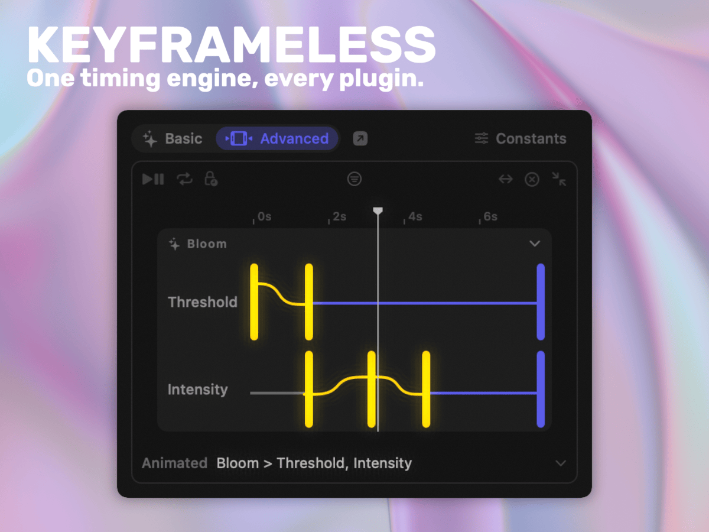
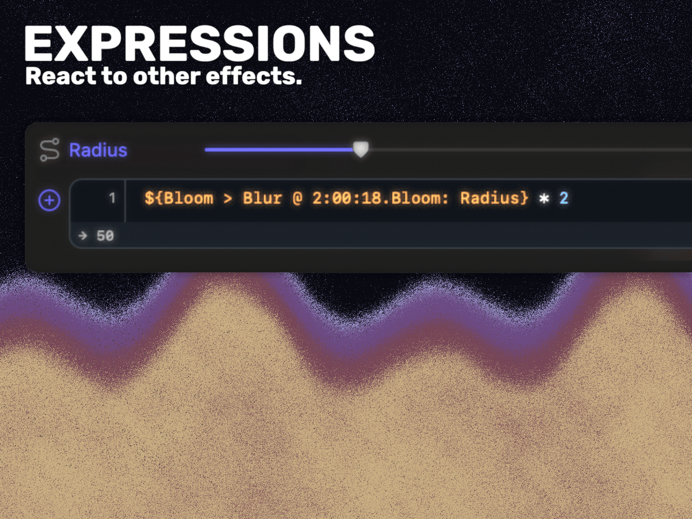
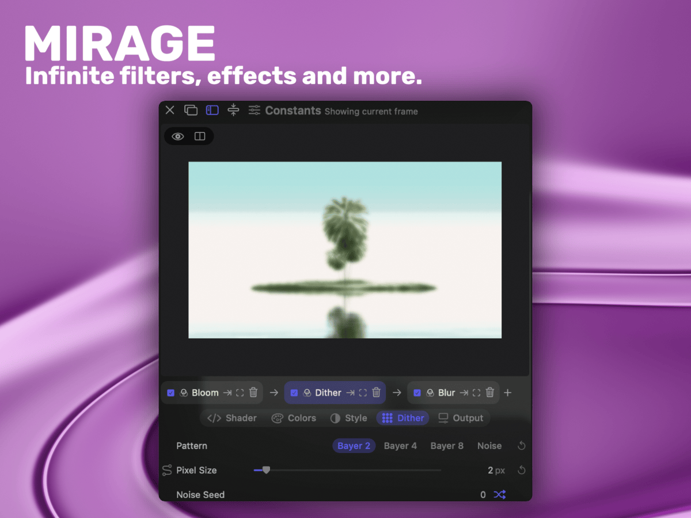
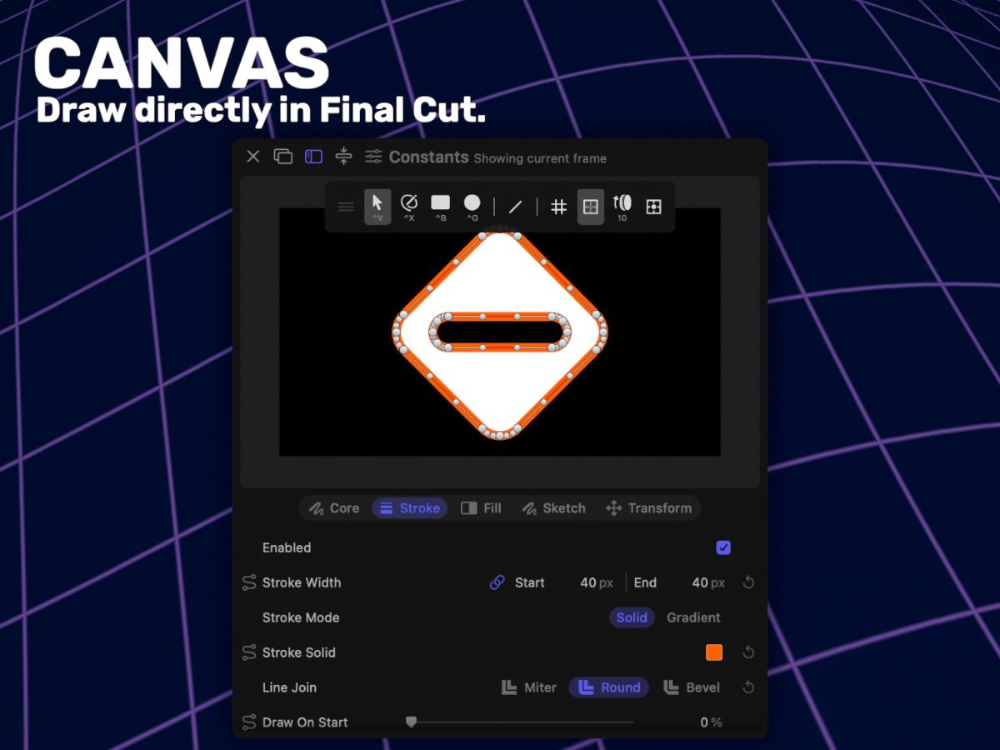
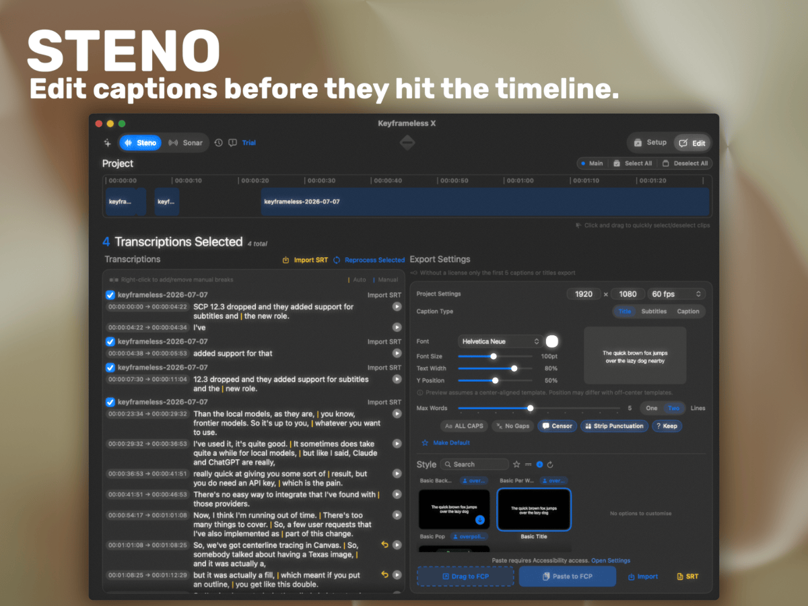
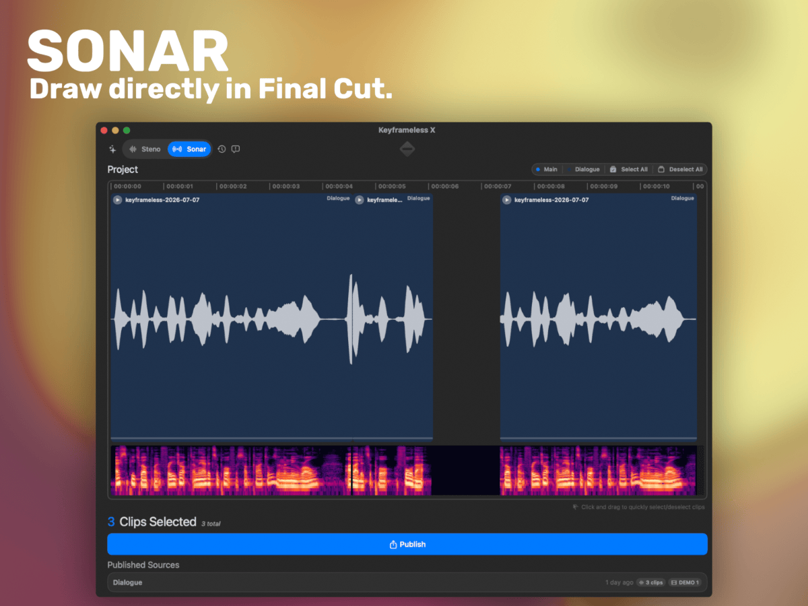
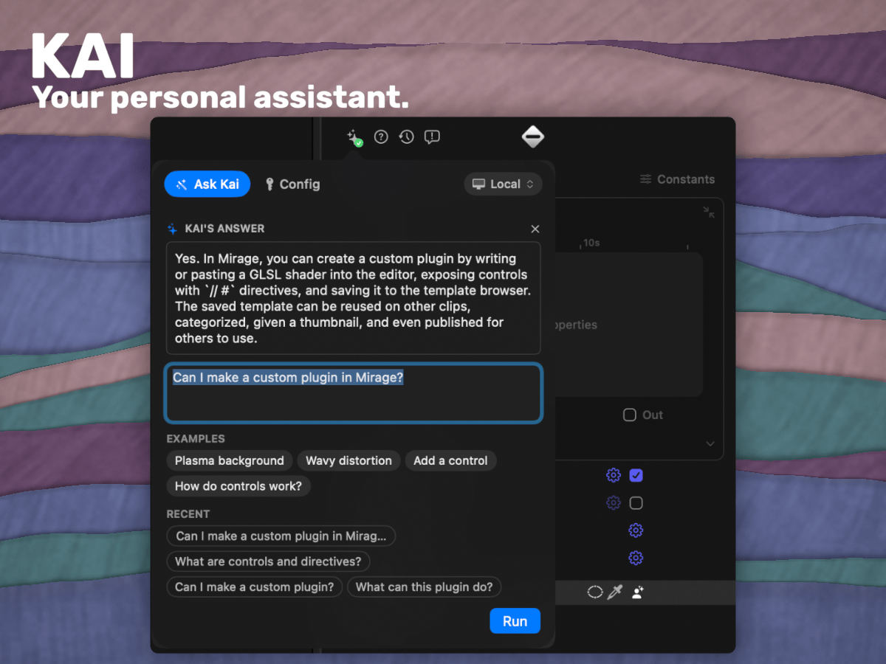

	

<h1 align="center">Keyframeless</h1>

	
    
    
    
    

 

	Making Final Cut Pro more than a video editor.

 

	

 

# Install

Get the installer from keyframeless.com. You can try every plugin for free before you buy. Buy it once and you can use it for paid work. You also get every plugin (when buying the Keyframeless Bundle) and update released in future.

	<a href="https://keyframeless.com"><b>keyframeless.com →</b></a>

 

You can build it yourself too. Clone the repo and open it in Xcode. Builds you make yourself are for personal work only under the [PolyForm Noncommercial licence](./LICENSE).

 

# What's included

The visual plugins all make things move in the same way. Set where something starts and ends, then adjust how it moves between the two. Once you've learned it in one plugin, you already know it in the others. No FCP keyframes or graph editor needed.

## Expressions

Final Cut Pro and Motion don't normally let plugins use expressions. Keyframeless does. Expressions are small bits of maths that work out a setting on every frame.

Use them to make something loop or drift, add noise, or make one clip follow another. They can sit on top of an animation you've already made. They work with things like position, size, and colour. The editor shows the value and a small graph while you type.

	

## Mirage

Mirage runs GLSL shader code inside Final Cut Pro. That means the same plugin can be a filter, transition, generator, layout, colour grading tool, or music visualiser.

Start with a template and use it as it is, change it, paste in a Shadertoy shader, or ask Kai to make something new. Templates aren't locked. Their code can add normal controls to the inspector, full colour tools, and handles you can drag in the viewer.

The rack lets you stack several shaders in one copy of Mirage. A shader can also reuse older frames to make trails, feedback, and effects that grow over time. You can save your own work and share it in the community browser. If a shader needs to react to music or speech, Sonar gives it the audio data.

	

## Canvas

Canvas lets you draw inside Final Cut Pro. Use the pen tool, bring in an SVG, or trace an image into a path you can keep editing in the viewer.

Each Canvas clip has layers for shapes, images, and groups. Every layer gets its own stroke, fill, draw-on, movement, opacity, and timing. You can join shapes together, cut one out of another, or add a rough hand-drawn finish with Sketch.

Most editing happens right in the viewer. Press `^X` for the pen, double-click a point to switch between a corner and a curve, or `opt+click` to remove it. You can also tell Kai what you want to make.

	

## Steno

Steno makes captions from a Final Cut Pro timeline on your Mac. Drop in a project, choose the clips you need, then fix the text and line breaks before anything goes back into Final Cut. Each word keeps its timing. You can use Whisper, Parakeet, or mix the two in one batch.

It listens to the same audio you hear in Final Cut, including volume changes, EQ, compressors, and compound clips. Send the captions back as animated Titles or normal FCP Subtitles (12.3+). You can also import as native iTT, SRT, and CEA-608 captions. Steno has a community browser for caption templates, and it works with Motion templates you make yourself too.

	

 

	
	
An Actual Caption Tool for Final Cut Pro

 
 

> [!WARNING]
> Intel Macs are much slower at transcription and can't run the best models. Apple silicon is recommended.

## Sonar

Sonar is a free tool in Keyframeless X. It shows your project's audio on a timeline, with a spectrogram underneath. Pick the music, speech, sound effects, or individual clips you want a visual to follow. Then press Publish.

Sonar uses the finished audio, so trims, fades, volume changes, compressors, and EQ all count. Mirage can use music for one shader and speech for another. Future Keyframeless plugins can use the same audio too.

	

## Kai

Kai is the AI assistant inside every Keyframeless plugin. It can explain a control, help with an animation, or make one from a description. Install Kai if you want to run it on your Mac with a downloaded local model. In local mode you don't need an account, API key, or subscription, and nothing leaves your Mac. You can also connect Claude or ChatGPT with your own API key.

	

 

# Source and licence

The code in this repo uses the [PolyForm Noncommercial 1.0.0 licence](./LICENSE). You can read it, learn from it, and make your own build for personal use.

The installer from [keyframeless.com](https://keyframeless.com) comes with a [commercial-use licence](./COMMERCIAL-LICENSE.md) for one person. It can't be transferred. All current and future plugins (when purchasing the Keyframeless Bundle) and updates are included.

Older releases were distributed under GPLv3 and stay that way. [Final GPLv3 release](https://github.com/overpolish/keyframeless/releases/tag/2026-04-11)
