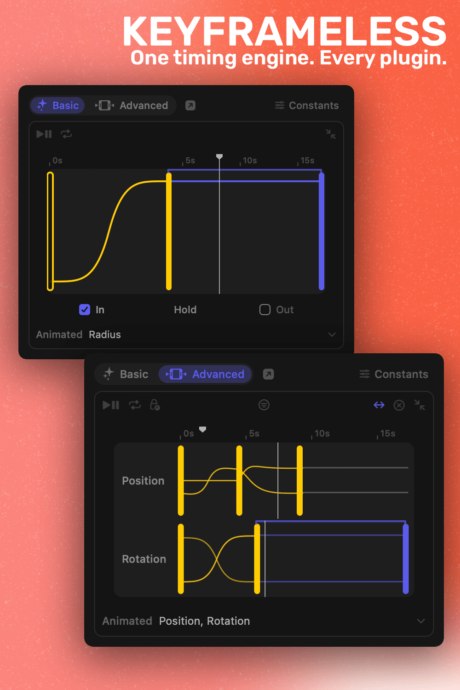
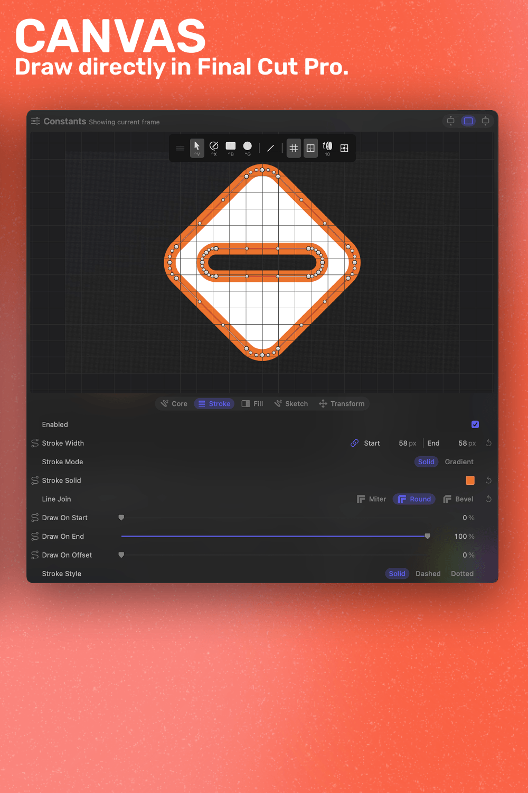
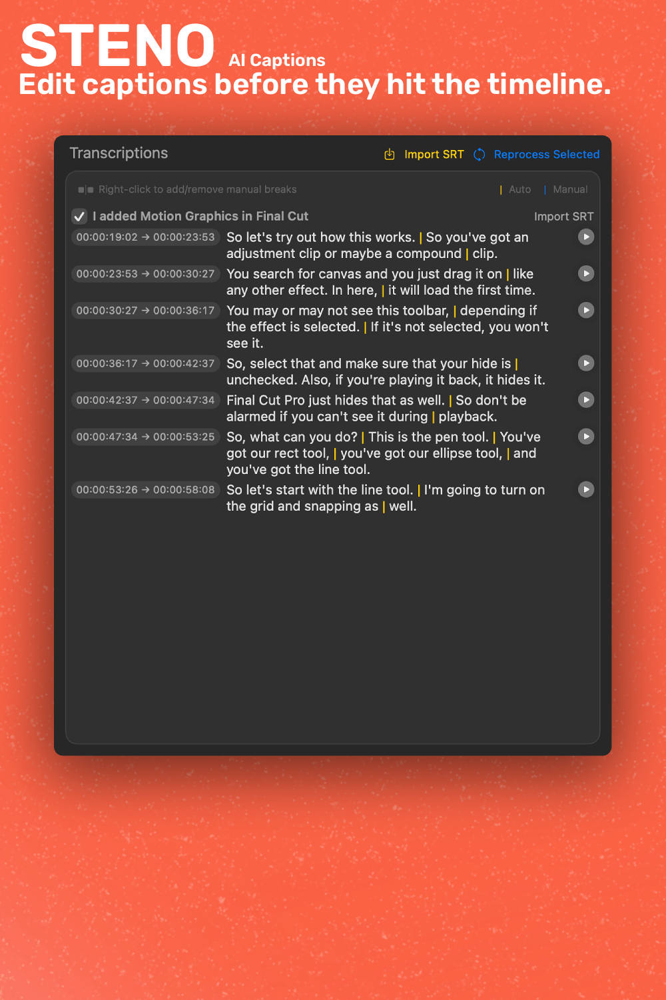
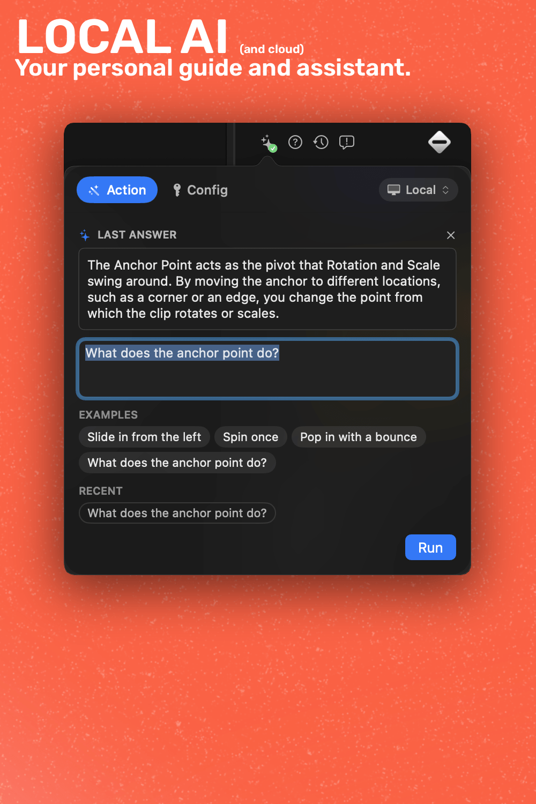

	

<h1 align="center">Keyframeless</h1>

	
    
    
    
    

 

	Final Cut Pro, without the keyframes. Set where things start and end, and they move between them on their own.

 

	

 

<b>Table of Contents</b>

- [Install](#-install)
- [Supercharge Your Workflow](#️-supercharge-your-workflow)
  - [Canvas](#canvas)
  - [Steno](#steno)
  - [Keyframeless AI](#keyframeless-ai)
- [Source & License](#-source--license)

 

# 🤝 Install

Grab the installer from Payhip. One payment supports continued development, and every future update is included.

	<a href="https://keyframeless.com"><b>keyframeless.com →</b></a>

 

Rather build it yourself? Clone the repo, open it in Xcode, and go. The source is [PolyForm Noncommercial](./LICENSE), so self-built use is for personal projects only. Paying gets you a signed installer with a [commercial-use license](./COMMERCIAL-LICENSE.md) for paid client work, plus all future plugins and updates.

 

# ⚡️ Supercharge Your Workflow

Plugins built on one shared timing engine. Learn the timing once and it works the same across all of them. No keyframes to place, no graph editor to fight.

## Canvas

Actual vector drawing inside Final Cut Pro. Draw paths with a real pen tool, drop in SVGs, or trace an image down to an editable line. The drawing tool Final Cut never had.

Each clip holds a stack of layers: shapes, images, and groups. Every one animates on its own, with stroke, fill, draw-on, transform, and opacity on the shared timing engine. Combine shapes with booleans, give the whole thing a hand-drawn look, and drag handles right in the viewer (`^X` for the pen, double-click a point to toggle corner or curve, `opt+click` to remove one). Describe an animation in plain words and the built-in assistant builds it for you.

	

## Steno

Ever felt like AI caption tools are too basic? Steno transcribes your timeline on-device and lets you edit every caption _before_ it hits Final Cut Pro. See your actual FCP audio, pick which clips to transcribe, and mix models across a batch.

It transcribes the audio Final Cut actually plays, with your compressor, EQ, and volume applied first, and it handles compound clips the same way. Fix the text, set line breaks, and every word keeps its timing. Export as animatable Title captions with Motion templates, native FCP Subtitles, or standard iTT, SRT, and CEA-608. There's a community template repo built in, or make your own Motion Templates, customize their parameters, and drag them in.

Supported Models:

- Whisper
- Parakeet

	

 

	
	
An Actual Caption Tool for Final Cut Pro

 
 

> [!WARNING]
> Intel performance is limited by CPU. For best performance, and better models, Silicon is recommended.

## Keyframeless AI

Every plugin has AI built in. Describe an animation in plain words, or ask how something works. Keyframeless AI runs those models entirely on your Mac: no cloud, no API key, no subscription. It's a free, optional download, and every plugin shares it. Prefer the cloud? Bring your own Claude or ChatGPT key instead.

	

 

# 📜 Source & License

Keyframeless is dual-licensed:

- **Source code:** [PolyForm Noncommercial 1.0.0](./LICENSE) enabling you to read it, learn from it, and build it for personal use.
- **Paid installer (Payhip):** [Commercial-use license](./COMMERCIAL-LICENSE.md) granted to the named purchaser. One person, non-transferable, all current and future updates included.

Older releases were distributed under GPLv3 and stay that way. [Final GPLv3 release](https://github.com/overpolish/keyframeless/releases/tag/2026-04-11)
</content>
</invoke>
