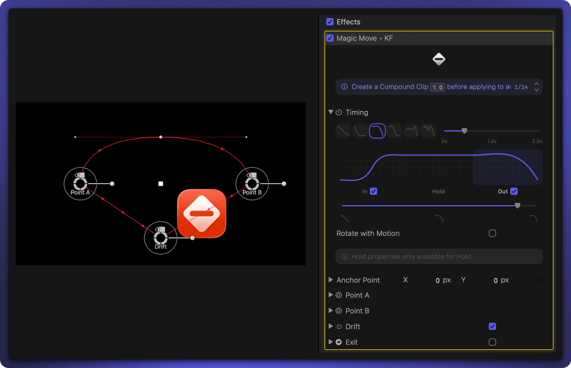
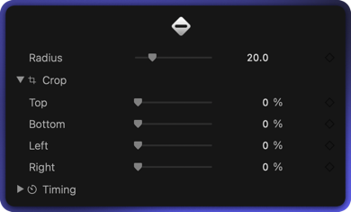

	

<h1 align="center">Keyframeless</h1>

	
	
	
	
	

 

	Drastically speed up editing with intuitive On Screen Controls, and <i>no</i> keyframes.

 

	

 

<b>Table of Contents</b>

- [Install](#-install)
- [Supercharge Your Workflow](#️-supercharge-your-workflow)
  - [Magic Move](#magic-move)
  - [AI Captions](#ai-captions)
  - [Motion Blur](#motion-blur)
  - [Rounded](#rounded)

 

# 🤝 Install

Download the latest version from the [Releases](https://github.com/overpolish/keyframeless/releases) page. Pick and choose which features you want to install.

	

 

# ⚡️ Supercharge Your Workflow

No clutter in your inspector with working groups in Final Cut Pro.

	

## Magic Move

Easy to use animation engine with, you guessed it, no keyframes. You have the option of enable/disabling 4 points `A`, `B` (always on), `Drift`, and `Exit`.

Intuitive on-screen controls make animating a breeze, for more fine-tuning you can go into each point and be as precise as you need.

	<video width="800" src="./.github/images/magic-move-demo.mp4" autoplay loop muted playsinline></video>

## AI Captions

Ever felt like AI caption tools are too basic? No way to edit captions before pulling them into Final Cut Pro, leaving you to fix things title-by-title? This is the first clip-based caption workflow - see your Final Cut Pro audio timeline, pick which clips to transcribe, and use different models for different clips.

There's also community captions — download and use existing ones, or make your own Motion Templates, drag them in, and you're good to go. Customize published parameters **BEFORE** dragging them into Final Cut Pro so you don't have to touch titles once they're on the timeline.

	<video width="800" src="./.github/images/ai-captions-demo.mp4" autoplay loop muted playsinline></video>

 

	
	
An Actual Caption Tool for Final Cut Pro

 
 

> [!WARNING]
> Intel performance is limited by CPU. For best performance, and better models, Silicon is recommended.

## Motion Blur

Use Motion Blur on an Adjustment/Compound Clip to allow quick enable/disable Motion Blur across your project. Now, you can disable it whilst working and enable it on render.

	<video width="800" src="./.github/images/motion-blur-demo.mp4" autoplay loop muted playsinline></video>

## Rounded

Easily crop and round your videos corners,

	<video width="800" src="./.github/images/rounded-demo.mp4" autoplay loop muted playsinline></video>

