

	

<h1 align="center">Keyframeless</h1>

	
    
    
    

 

	Drastically speed up editing with intuitive On Screen Controls, and <i>no</i> keyframes.

 

	
	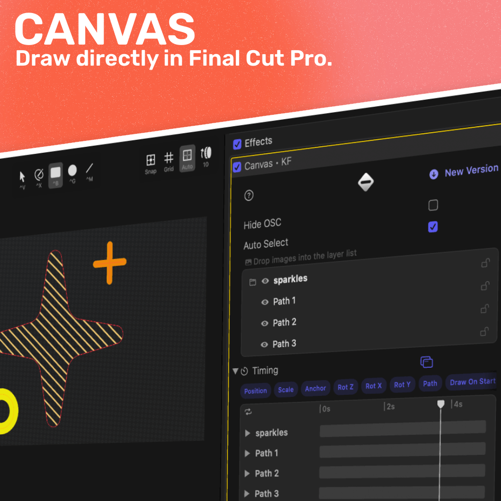
	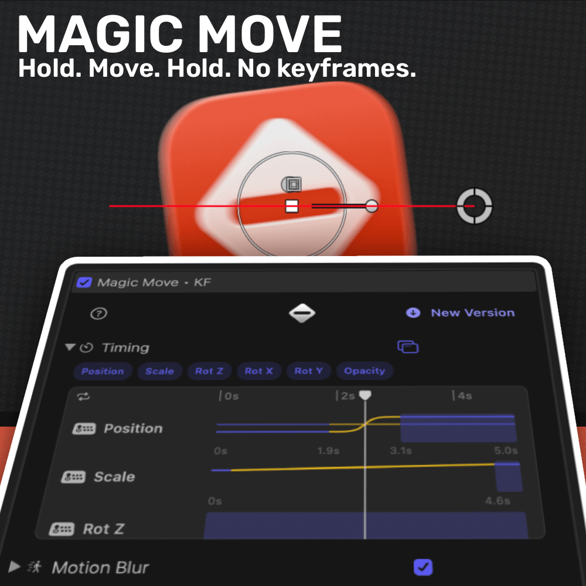

	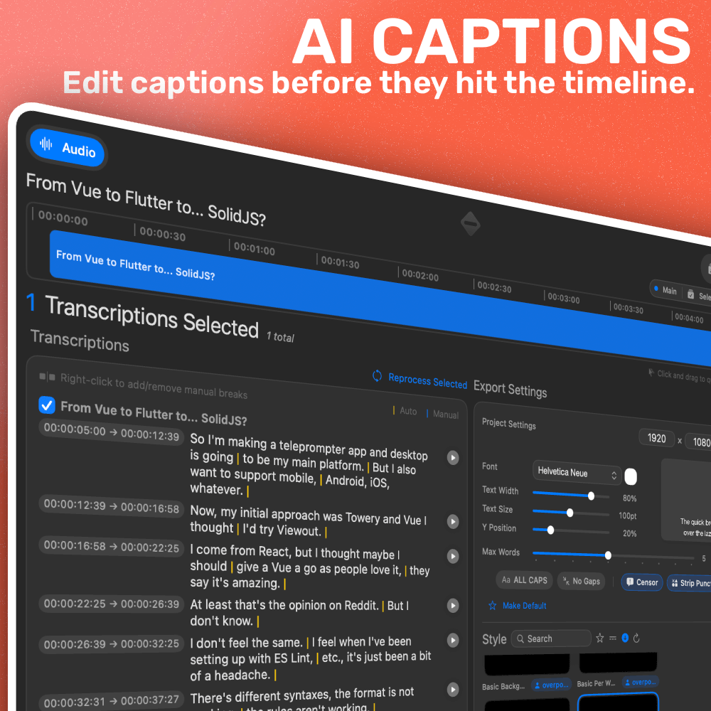
	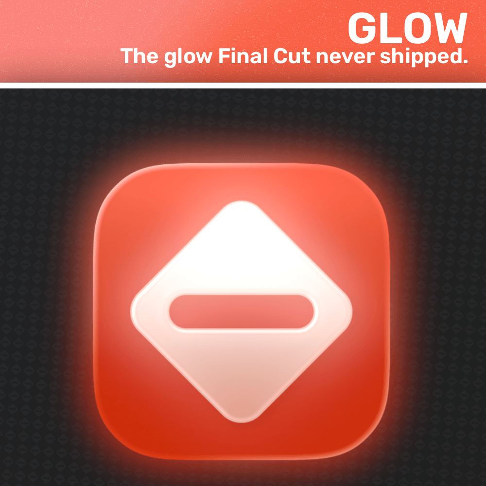
	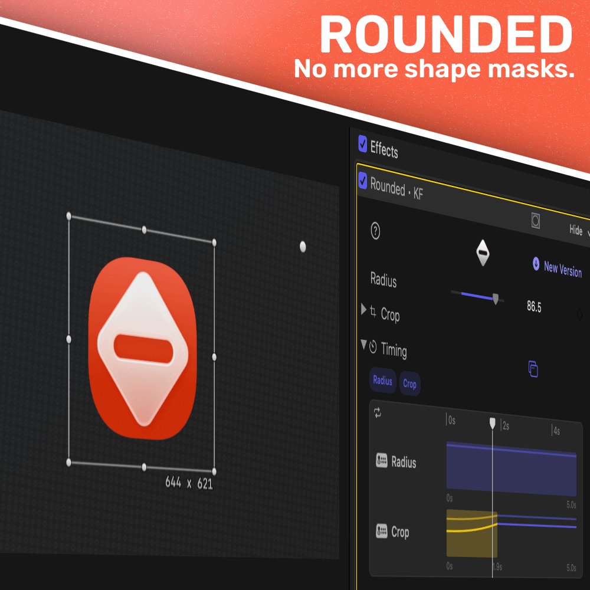

 

<b>Table of Contents</b>

- [Install](#-install)
- [Supercharge Your Workflow](#️-supercharge-your-workflow)
  - [Canvas](#canvas)
  - [Magic Move](#magic-move)
  - [AI Captions](#ai-captions)
  - [Glow](#glow)
  - [Rounded](#rounded)
- [Source & License](#-source--license)

 

# 🤝 Install

Grab the installer from Payhip - one payment to help support continued development, all future updates included.

	<a href="https://store.overpolish.co/b/QG73g"><b>Buy on Payhip →</b></a>

 

 

	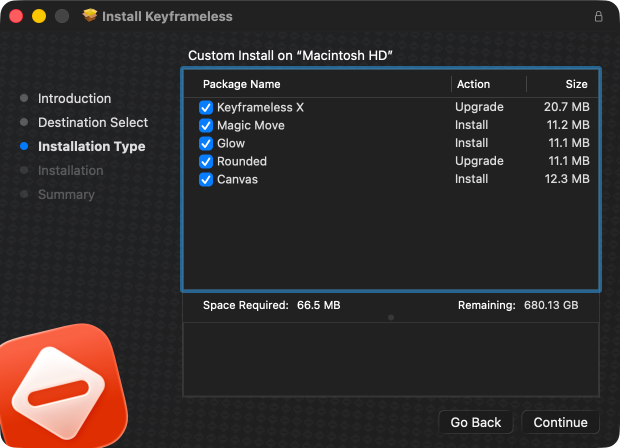

 

If you'd rather build Keyframeless yourself than pay for the installer, you can - clone the repo, open it in Xcode, and go. Note the source is [PolyForm Noncommercial](./LICENSE), self-built use is for personal projects only. Paying gets you a signed installer with a [commercial-use license](./COMMERCIAL-LICENSE.md) for paid client work, plus all future plugins and updates.

 

# ⚡️ Supercharge Your Workflow

## Canvas

Actual vector drawing inside Final Cut Pro. Drop in SVGs or draw paths from scratch with bezier control - the drawing tool Final Cut never had.

Each path animates independently with draw-on, trim, opacity, and the same timing engine the rest of the suite uses. Handwritten signatures, scribbled annotations, animated illustrations, all without leaving the timeline. Drag handles directly in the viewer for fine-tuning, `opt+click` to add points, double-click to toggle linear/curve.

	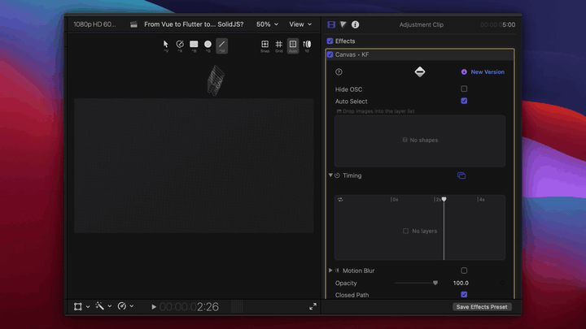

## Magic Move

Animation built around a simple mental model - think in seconds, not keyframes. Each property (Position, Scale, Rot X/Y/Z, Opacity) gets its own lane in the sequencer, and you fill it with as many `hold` and `move` segments as you need. Drag to resize, double-click to split, `cmd-click` to delete, `shift-click` to lock a segment to an absolute duration.

Real easing curves per transition - Linear, EaseIn/Out/InOut, Elastic, Bounce - rather than the 3 options FCP gives you. Hold segments can ride a Bounce or Wiggle effect with adjustable intensity and frequency, so static doesn't have to mean lifeless.

	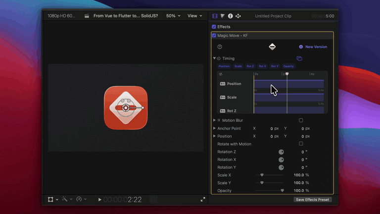

## AI Captions

Ever felt like AI caption tools are too basic? No way to edit captions before pulling them into Final Cut Pro, leaving you to fix things title-by-title? This is the first clip-based caption workflow - see your Final Cut Pro audio timeline, pick which clips to transcribe, and use different models for different clips.

There's also community captions - download and use existing ones, or make your own Motion Templates, drag them in, and you're good to go. Customize published parameters **BEFORE** dragging them into Final Cut Pro so you don't have to touch titles once they're on the timeline.

Supported Models:

- Whisper
- Parakeet

	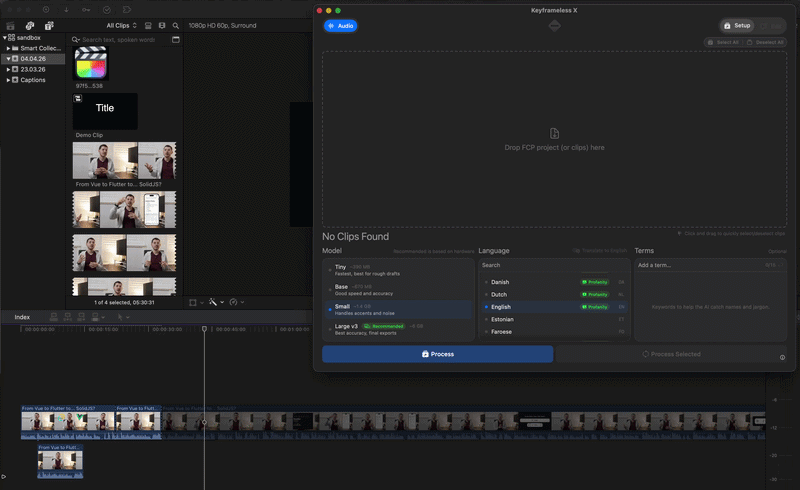

 

	
	
An Actual Caption Tool for Final Cut Pro

 
 

> [!WARNING]
> Intel performance is limited by CPU. For best performance, and better models, Silicon is recommended.

## Glow

Add glow effects with solid, gradient, and dynamic colour support. Also doubles as a drop shadow. Animate glow in and out with full timing control, and use outward noise for organic, evolving edges.

	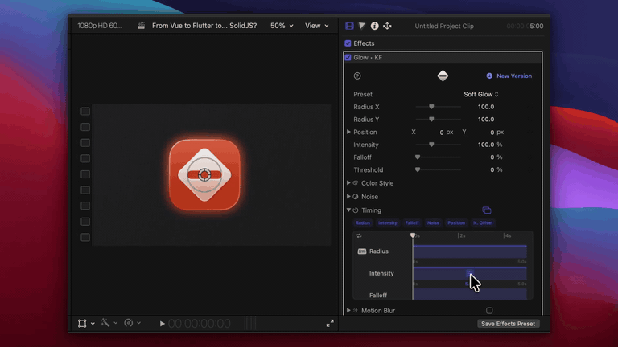

## Rounded

Easily crop and round your video's corners.

	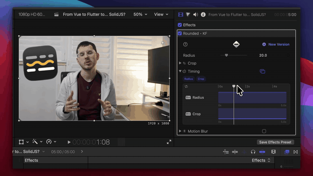

 

# 📜 Source & License

Keyframeless is dual-licensed:

- **Source code:** [PolyForm Noncommercial 1.0.0](./LICENSE) enabling you to read it, learn from it, and build it for personal use.
- **Paid installer (Payhip):** [Commercial-use license](./COMMERCIAL-LICENSE.md) granted to the named purchaser. One person, non-transferable, all current and future updates included.

Older releases were distributed under GPLv3 and stay that way - [Final GPLv3 release](https://github.com/overpolish/keyframeless/releases/tag/2026-04-11)
