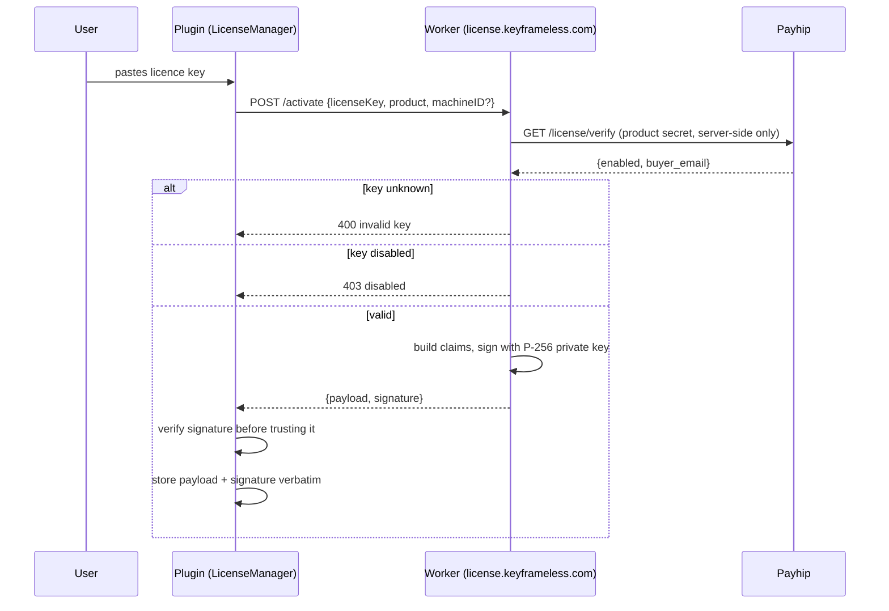
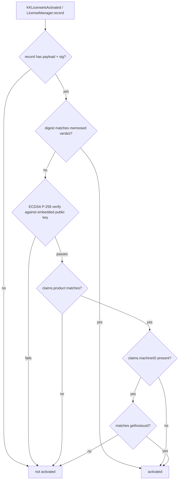

# License activation

Activation is **once, online**. Everything after it is offline forever: no re-verification, no expiry, no phone-home.

## Why a Worker

Payhip already tells us whether a key is real. The problem is anyone could write with a single `defaults` command without ever touching the licence check.

Making that record unforgeable needs a secret the user's machine doesn't have. That is the Worker's only job: hold the private key, and sign. The plugin ships the public half and can therefore _check_ a record but never _produce_ one.

It is stateless. Payhip stays the source of truth for validity and for disabled keys, so there is no database to run or back up.

## Activation



The client verifies the response before storing it. A compromised or misbehaving endpoint therefore cannot activate anything.

## Every check after that



`KKLicenseIsActivated` runs per rendered frame, so the verdict is memoised against a SHA-256 of the record and only re-verified when the record itself changes.

Two implementations must agree, or the trial banner and the render disagree about whether the product is activated:

|                                               | verification                                        |
| --------------------------------------------- | --------------------------------------------------- |
| `KeyframelessKit/Plugin/Support/KKLicense.m`  | `SecKeyVerifySignature`, gates the render watermark |
| `KeyframelessAI/License/LicenseManager.swift` | CryptoKit `P256`, gates the trial UI                |

The public key bytes are duplicated in both and must stay byte-identical.

## The signed payload

Exactly these bytes are signed, stored, and verified. Neither side ever re-serialises the JSON: a different key order or spacing is a different message and the signature stops matching.

```json
{
  "product": "mirage",
  "keyHash": "<sha256 of the licence key>",
  "issuedAt": 1753689600,
  "email": "buyer@example.com"
}
```

`keyHash` rather than the key, so a stored record does not carry the purchase credential in the clear. The key itself is kept alongside the record for display and for re-activating on another machine, and grants nothing on its own.

## Machine binding

The signed payload carries the activating machine's `gethostuuid`, and both clients reject a record whose `machineID` is not this machine.

Activations are UNCAPPED. The Worker holds no state, so the same key re-signs for any machine that asks. A new machine simply activates again, needing the internet once, exactly like the first install, with nothing to reset and no support mail.

What it buys: an activated record copied to another machine stops working. What it does not: a shared _key_ still activates anywhere.

## Rotating the key pair

Invalidates every record ever issued and forces everyone to re-activate. Only do it if the private key leaks.

```
openssl ecparam -name prime256v1 -genkey -noout -out license-private.pem
openssl pkcs8 -topk8 -nocrypt -in license-private.pem -outform DER | base64   # LICENSE_PRIVATE_KEY_PKCS8
openssl ec -in license-private.pem -pubout -text -noout                       # the `pub:` block, 65 bytes
```

Paste the 65 bytes into `kKKLicensePublicKey` (KKLicense.m) and `publicKeyX963` (LicenseManager.swift). The private key belongs in Bitwarden and in `wrangler secret put`, never in this repo.

## Deploying

For routine Payhip secret updates, put the values in
`Server/license-worker/.dev.vars`:

```dotenv
PAYHIP_SECRET_MIRAGE=
PAYHIP_SECRET_CANVAS=
PAYHIP_SECRET_STENO=
```

`.dev.vars` is gitignored and must never be committed. From the repository
root, upload all three secrets in one request:

```
wrangler secret bulk Server/license-worker/.dev.vars --config Server/license-worker/wrangler.jsonc
```

Do not include `LICENSE_PRIVATE_KEY_PKCS8` in routine secret updates. Replacing
it invalidates every issued activation unless the value is the same private key.

For the initial deployment, set the signing key interactively and deploy the
Worker:

```
wrangler secret put LICENSE_PRIVATE_KEY_PKCS8 --config Server/license-worker/wrangler.jsonc
wrangler deploy --config Server/license-worker/wrangler.jsonc
```
