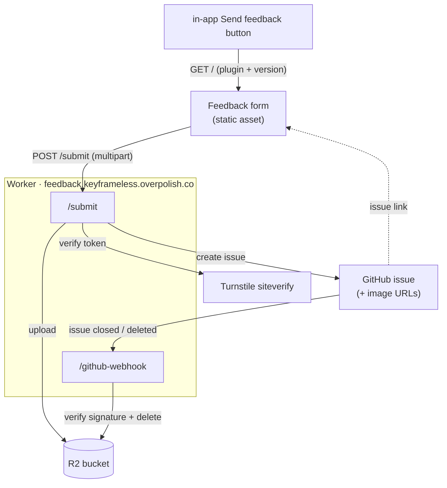

# keyframeless-feedback

Cloudflare Worker behind the in-app "Send feedback" button. It serves the form (`public/index.html`) as a static asset and exposes `POST /submit`, which verifies a Cloudflare Turnstile token, uploads any screenshots to R2, and opens a GitHub issue in `overpolish/keyframeless`. A second route (`/github-webhook`) deletes an issue's screenshots from R2 when it's closed. The GitHub token, Turnstile secret, and webhook secret live only in Worker secrets - they never reach the client.

## Architecture



Static assets are matched first; only `/submit` and `/github-webhook` reach the
Worker code.

## One-time setup

1. **Cloudflare account** + wrangler: `npm i -g wrangler && wrangler login`.
2. **Turnstile widget** (dashboard → Turnstile). Add domains `feedback.keyframeless.overpolish.co` and `localhost`. Note the **site key** and **secret key**.
3. Put the **site key** into `public/index.html` (replace `TURNSTILE_SITE_KEY` in the `data-sitekey` attribute).
4. **GitHub PAT**: fine-grained, scoped to `overpolish/keyframeless` only, permission **Issues: Read and write**.
5. **Labels**: create these in the repo so they can be applied - `feedback`, `bug`, `idea`, `rounded`, `magicmove`, `canvas`, `glow`, `keyframelessx`. (Missing labels are tolerated: the Worker retries without them, but the issue then lands unlabelled.)
6. **R2 bucket** for screenshots: `wrangler r2 bucket create keyframeless-feedback`, then enable the public **r2.dev** URL (dashboard → R2 → bucket → Settings) and set it as `R2_PUBLIC_URL` in `wrangler.jsonc`. Uploads cap at 5 images, 10MB each.
7. **Webhook** (screenshot cleanup): repo → Settings → Webhooks → Add. Payload URL `https://<worker-domain>/github-webhook`, content type `application/json`, secret = `GITHUB_WEBHOOK_SECRET`, events: **Issues** only. As a TTL backstop, add a bucket lifecycle rule deleting the `feedback/` prefix after ~180 days.

## Secrets

Local (`wrangler dev`): copy `.dev.vars.example` to `.dev.vars` and fill in.

Production:

```
wrangler secret put TURNSTILE_SECRET
wrangler secret put GITHUB_TOKEN
wrangler secret put GITHUB_WEBHOOK_SECRET
```

`GITHUB_REPO` and `R2_PUBLIC_URL` are non-secret vars in `wrangler.jsonc`.

## Develop

```
npm install
npm run dev      # serves form + /submit at http://localhost:8787
```

The in-app DEBUG build points the feedback button at `http://localhost:8787/`, so run this while testing the plugins locally.

## Deploy

```
npm run deploy
```

To serve at `feedback.keyframeless.overpolish.co`, the `overpolish.co` zone must be on Cloudflare; then uncomment the `routes` custom-domain block in `wrangler.jsonc`. Until then the Worker is reachable at its `*.workers.dev` URL (update the prod URL in `KKUpdateChecker.m` to match if you ship before the custom domain is live).
